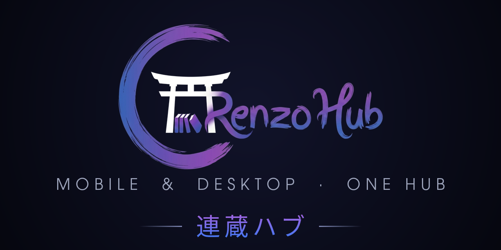

<p align="center">
  
</p>

# Renzo Hub

One client for both halves of the Renzo ecosystem — **Renzo** (anime) and
**Renzo Shiori** (manga) — on Android phone, Android TV and Windows.

A launch picker chooses a half when the app starts (and again when it returns
after a spell in the background); each half keeps its own server URL and
credentials, and "Switch to …" in the hamburger menu moves between them without
leaving the activity. TV shows Renzo only, by design: Shiori has no TV story.

**Current release: 1.4.5 (versionCode 50).**

Renzo Hub replaces the per-service installers. As of 2026-08-21 the standalone
Renzo and Renzo Shiori APKs and EXEs are retired and no longer published — this
is the only shipping client.

## Platforms

| Target | Module | Output |
|---|---|---|
| Android phone / tablet | `:app` | APK (`top.levitatemedia.renzo`) |
| Android TV | `:app` | same APK, leanback entry straight into Renzo |
| Windows | `:hub-desktop` | Compose Desktop, packaged with jlink + NSIS |

## Module layout

```
:app             launcher, manifest (both intents), branding, signing
:core            session, prefs, image loading, offline downloads,
                 TV pairing, platform abstractions
:feature-renzo   anime UI + Media3 player
:feature-shiori  manga UI + reader
:hub-desktop     Windows entry point and packaging
```

217 Kotlin files. Both feature modules **keep their original package names**
(`top.levitatemedia.renzo.tv`, `app.renzoshiori.client`) as their AGP namespace.
With `android.nonTransitiveRClass=true` each keeps its own `R`. Do not "tidy"
these into a common package — that trade buys nothing and costs a 200-file diff.

`:feature-renzo` and `:feature-shiori` must never import each other; anything
genuinely shared belongs in `:core`.

## The parity rule

Hub is one of three surfaces — Shiori web, Renzo web, Hub — and parity between
them is **bidirectional**. A change to user-facing behaviour on any surface is a
candidate for the other two. Hub is genuinely ahead of the web in places
(offline reading, TV, page scale), so `hub → web` is as real a direction as
`web → hub`.

Native screens are **transliterated from the web component source, not
approximated** — "copy and paste, but in Kotlin". Where the web keeps two
variants of the same thing in two files, port both faithfully rather than
tidying them into one; that difference is usually deliberate.

- `docs/UI_PARITY.md` — the screen-by-screen map.
- `docs/PARITY-GAPS.md` (and `.pdf`) — open gaps with evidence and a fix each,
  plus a register of differences that are **deliberate** and must not be closed.

## Toolchain

| | Version |
|---|---|
| AGP | 8.13.0 |
| Kotlin | 2.4.10 |
| Gradle | 8.14.3 |
| compile / targetSdk | 36 |
| JDK | 21 |
| Compose BOM | 2026.06.01 |
| Coil | 3.5.0 |
| androidx.tv-material | 1.1.0 |
| Media3 | 1.7.1 |

Media3 is deliberately held at **1.7.1** rather than the current 1.10.x. The
player is the most fragile thing here; a media3 bump is an independent change
with its own regression surface.

`local.properties` (untracked) must point `sdk.dir` at an SDK with android-36
and build-tools 36.0.0.

## Build

```bash
./gradlew :app:assembleDebug                 # app/build/outputs/apk/debug/
./gradlew :app:assembleRelease               # R8 + resource shrinking
./gradlew :app:assembleBeta                  # side-by-side install, separate appId
./gradlew :app:assembleDemo                  # fixture-backed screenshot build
./gradlew :feature-shiori:compileKotlinDesktop   # fastest sanity check
```

**Build the APKs before any desktop target.** Compiling a desktop target first
poisons Gradle's *transform* cache with Kotlin metadata from the wrong variant,
and `clean` does not touch the transform cache — recovery means deleting
`~/.gradle/caches/<gradle-version>/transforms/`.

### Signing

`assembleRelease` reads an untracked `key.properties` at the repo root
(`keystoreFile`, `keystorePassword`, `keyAlias`, `keyPassword`) and falls back
to the debug key when it is absent. Neither the keystore nor `key.properties` is
in this repository or its history.

Hub inherits Renzo's `applicationId` and signing key: Renzo is the half headed
for Google Play, and a listing is bound to both permanently. Old Shiori installs
(`app.renzoshiori.client`) cannot upgrade in place — they reinstall, losing the
saved server URL, session and offline chapters.

## Predecessors

Renzo Hub supersedes four trees, all now **archived with a build guard that
exits non-zero**:

- `shiori/clients/android` — standalone manga APK
- `renzo-clients/tv-native` — standalone anime APK
- `renzo-clients/capacitor` — old Capacitor shell
- `renzo-clients/android` — old raw-WebView client

Edits to any of them reach nobody. This is not hypothetical: on 2026-08-21 an
18+ filter fix landed in the archived manga fork instead of the shipping client,
leaving users with a 24-tag-short adult filter for five and a half hours. If a
document tells you one of those trees is live, that document is stale.

## Brand assets

`docs/brand/` holds the source artwork:

| File | Size | Use |
|---|---|---|
| `renzo-hub-banner.png` | 1280×640 | README header and the GitHub social preview |
| `renzo-hub-wordmark.png` | 1236×702 | transparent lockup — login and splash banners |
| `renzo-hub-icon.png` | 1024×1024 | transparent mark — app and launcher icon source |
